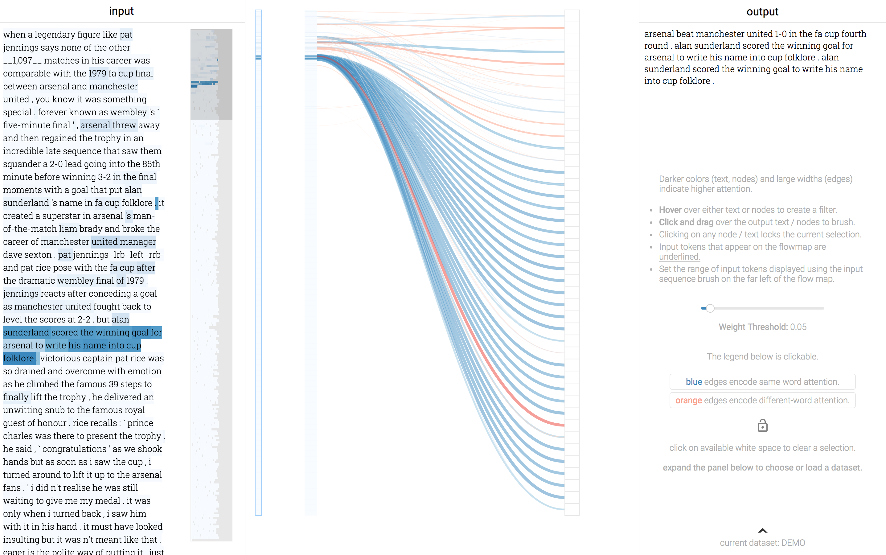

# attention-visualization

This repository anonymously houses the visualization system described in VIS 2018 submission 1146.

## Development

To install dependendies, run `yarn`.
To start a local dev server, run `yarn start`.
To build a distribution, run `yarn build`.
To deploy to github pages, run `yarn deploy`.